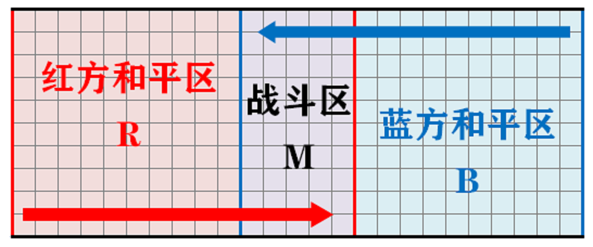
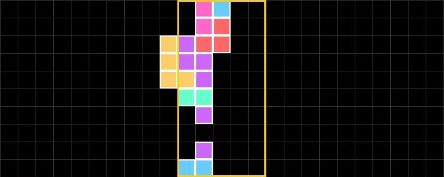
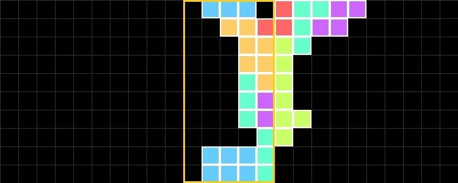
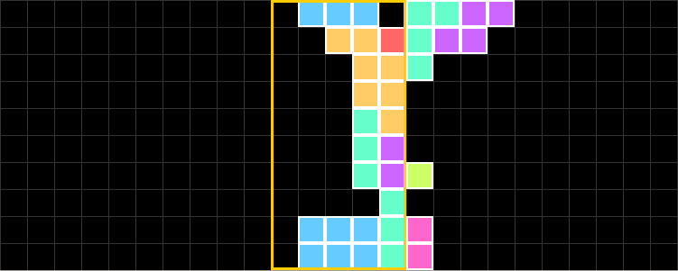

# Tetris——方块大战比赛规则

## 引言

此文档是"Tetris——方块大战"的规则文档.

## 总述

"Tetris——方块大战"是基于俄罗斯方块改编的AI对战游戏，鼓励双方激烈对抗而非彼此封闭.  
参战双方在同一比赛场地内通过移动, 旋转和摆放七种方块, 使之排列成完整的一列或多列进行消除得分, 得分高者获胜.

## 基本概念

### 方块种类及其旋转规则

如下图所示, 一共有七种不同的方块. 由上至下, 依次为I, J, L, O, S, T, Z型.  
我们使用每个方框的中心(即图中白色圆圈的位置)来描述每个方块的位置.  
每种方块有四种不同的方向(`direction`), 从左至右依次编号为0, 1, 2, 3.  
以I型块(淡蓝)为例, 当玩家只改变其方向而不改变其位置时, 除中心块外的其余方块相对位置均会发生变化!  
注：  
  
   1. 在本文档中提及的“消行”，“消列”，“行”，“列”均指垂直于方块降落方向的1\*10的区域，无特殊区别.
   2. 在本文档中提及的“方块”均指有4个格构成的某种俄罗斯方块，而方块有4个格构成

### Package

一个内含打乱顺序的七个种类不同的方块的集合被称为Package. 游戏过程中, 对战平台会自动生成80个Package, 组成BlockList. 玩家获得的方块依次从BlockList中取出, 取完则游戏结束.

### 比赛场地

如下图所示, 玩家分为红蓝两方, 其中红方为先手. 棋盘分为三个区域(R, M, B).  
和平区(R, B)为10\*10的棋盘, 战斗区(M)为5\*10的棋盘.  
红蓝双方轮流在棋盘中放置方块, 且自身投放的方块可以到达的底线是不同的(红线和蓝线).  
一方落块时，块无论如何不能进入对方的和平区，且需要遵守落块规则(见下).  

### 回合制

比赛采用回合制.  
规定下面的流程是一个回合，游戏中会重复回合直到游戏结束.  

   1. 先手玩家(红)给出落块位置.
   2. 对战平台进行消列处理与得分结算.
   3. 后手玩家(蓝)给出落块位置. (注意: 后手玩家会获得最新的棋盘状态)
   4. 对战平台进行消列处理与得分结算.

## 具体规则

### 落块规则(选看)

本部分规则实际上不需要用户理解, 因为游戏平台向AI提供了获得所有合法落块位置的接口(详见用户文档)，但对于玩家制定AI战术可能有帮助.  
本游戏使用的落块规则基本与俄罗斯方块相同, 但有部分特殊规则.  
平台落块原理如下:  
落块开始之前, 系统首先在对战场地外的一个位置生成本回合方块, 随后玩家执行操作若干个, 直到出现以下情况之一:  
  
   1. 方块超出放置边界，或者与其他有方块的格发生了重叠，判定为该放置不合法(即方块不能有任何出界或碰撞).  
   2. 方块还可以继续竖直下移，但玩家结束操作，判定为该放置不合法(即方块不能悬空放置).  
   3. 方块已不能继续竖直下移，玩家结束操作，判定为该放置合法.  
  
玩家在落块过程中可以进行的操作包括：  
  
   1. 将方块水平左移或右移1格.  
   2. 将方块下移1格.  
   3. 将方块变换为一个旋转中心位置不改变的相同方块(即方块类型图中每一横行中的块).  

注：方块是否可以旋转只与旋转前后的方块所处的格有关，而与具体的旋转过程无关(即使具体的旋转过程会与其他格碰撞，这种旋转也可能是合法的).  

### 消列规则

对于上图所示的水平放置的场地而言, 当其中的某一列被填满时, 会触发消列.  
注意:

   1. 得分位置按照消列发生位置分区计算.(具体得分规则见[下一条](#得分规则))
   2. 战争区触发消列时, 所有己方和平区和战争区空列均将被移除，其余的每个行作为一个整体尽可能向己方底线移动.(具体示例见下图)  
   3. 和平区触发消列时，所有己方和平区空列均将被移除，其余的每个行作为一个整体向战斗区移动，但不会进入战斗区.(具体示例见下图)
   4. 可能因为消列的原因导致某些块处于悬空的状态，战斗区的行在只有和平区有消列的回合不会发生移动.  

战斗区消列示意图:  
  
  
  

和平区消列示意图:  
  
  
  

### 得分规则

计算公式：本回合得分 = 和平区消列得分 + 战斗区消列得分 + 连消奖励分  

分区得分与该区域消去列数关系见下表：  
行数|和平区|战争区
:-:|:-:|:-:
单消|0|1
双消|1|2
三消|2|4
四消|4|8
连消n次奖励分|--|n

注:

   1. 消除的列数按照消除总列数计算，与消除的列在本区域中所处的位置无关.  
   2. 和平区与战争区分别计算所得分数. (例: 玩家在一次操作中同时消掉了和平区两列与战争区的一列, 将会获得 1 + 1 + 连击奖励分; 如果有玩家在一次操作中同时消掉了和平区的一列与战争区的一列, 将会获得 0 + 1 + 连击奖励分)  
   3. 连消次数的计算按照回合结算. (对每一回合, 只要有玩家在战争区消去, 则连消次数加一. 即使双方都在战争区进行了消去, 连消次数仍然只会加一.若双方都没有在战争区消去，连消次数归零.)  
   4. "多消"是指在单次操作中在同一区域消除多列的表现, 包括"双消", "三消", "四消"(由于块的长度最大为四,理论上不会有超过四消的操作).  
   5. "连消"是对于回合而言的, 如果截至该回合开始时, 连消次数为n(即在本回合之前的n个回合内，每个回合都有玩家在战斗区消列), 则本回合在战争区消行可以获得连消奖励分n.  
   6. 玩家在战斗区进行消去的场合，计算玩家得分才会额外奖励连消分数，否则奖励分数为0. 本回合连消奖励分的分值不受本回合是否消去的影响.  

具体得分举例:

   1. 若当前连消次数为2. 本回合红方仅在和平区消了两列. 蓝方在和平区消了一列, 战争区消了两列. 则本回合红方得分为 1 + 0 + 0 = 1 (和平区结算得分 + 战争区结算得分 + 连击结算得分 , 下同), 蓝方得分为 0 + 2 + 2 = 4 . 连消次数变为3.
   2. 若当前连消次数为3. 本回合红方仅在和平区消了两列. 蓝方仅在和平区消了三列. 则本回合红方得分为 1 + 0 + 0 = 1 , 蓝方得分为 2 + 0 + 0 = 2 . 连消次数变为0.
   3. 若当前连消次数为3. 本回合红方仅在战争区消了一列. 蓝方在和平区消了一列, 战争区消了一列. 则本回合红方得分为 0 + 1 + 3 = 4 , 蓝方得分为 0 + 1 + 3 = 4 . 连消次数变为4.

### 胜负判定

   1. 若有玩家方块溢出, 则溢出者直接判负.
   2. 若有玩家进行非法操作, 直接判负. (非法操作包括但不限于: AI给出的方块放置位置与棋盘上已有的方块发生冲突)
   3. AI运行超时, 直接判负.
   4. 所有回合进行完毕, 得分高者获胜.  
   5. 若得分相同，用时少者获胜.  

## 编辑历史

2022.3.20 创建此文档  
2022.5.16 更新规则  
