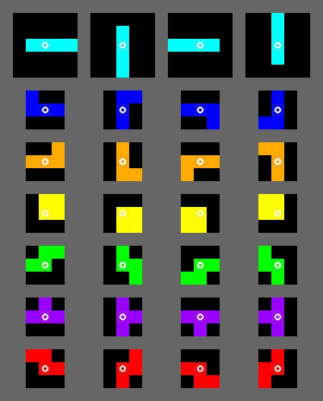

# Tetris——方块大战用户文档

## 目录

1. [引言](#引言)
   1. [两个名词](#两个名词)
2. [用户规范](#用户规范)
   1. [Tetris AI](#tetris-ai)
      1. 初始化__init__
      2. 输出output
   2. [注意事项](#注意事项)
3. [平台规范](#平台规范)
   1. [关于Block](#关于block)
      1. [Block的属性](#block的属性)
      2. [Block的简并(选看)](#block的简并选看)
   2. [关于Board](#关于board)
   3. [关于Action](#关于action)
      1. [Action的去重(选看)](#action的去重选看)
   4. [MatchData类](#matchdata类)
4. [本地可视化调试程序使用说明](#本地可视化调试程序使用说明)
5. [对战平台使用说明](#对战平台使用说明)
6. [编辑历史](#编辑历史)

## 引言

此文档是"Tetris——方块大战"的用户文档. 理论上, 使用本文档和规则文档就可以满足开发对战AI的技术需求. 如果您还没有看过"规则文档", 请[单击此处阅读"规则文档"](./%E6%AF%94%E8%B5%9B%E8%A7%84%E5%88%99.md)后, 再来阅读此文档.

### 两个名词

   1. 用户(或用户AI) : 根据语境, 可能指 "开发对战AI程序的人" 或 "能根据盘面给出决策的AI代码".

   2. 平台 : 指驱动对战初始化、进行和结束, 给出盘面信息和运行环境, 并调用用户AI的决策方法, 判断胜负的程序.

## 用户规范

本章节对用户AI的行为进行规范.

### Tetris AI

Tetris AI 是实现了根据现有盘面和当前块输出合法的放置位置的命名为`Player`的类.  

需要实现的成员方法具有以下原型：

```Python
class Player:
    def __init__(self: Player, isFirst: bool) -> None:
        pass
    def output(self: Player, matchData：MatchData) -> Tuple[int, int, int]:
        pass
```

平台将在对局开始前生成双方的AI实例, 每回合按照先后手轮流调用AI实例的`output`方法.

#### 初始化`__init__`

当平台需要生成一个新的用户AI实例时`__init__`方法被调用. (如下)

```Python
import alpha, bravo
red = alpha.Player(True) # 先手玩家实例生成
blue = bravo.Player(False) # 后手玩家实例生成
```

参数 isFirst 是一个布尔参量, 其真假表示本局中此 AI 是否是先手.

#### 输出`output`

1. 方法调用时机

    游戏开始后,每个回合按照先后手顺序执行 :

    1. 先手给出针对现有盘面和当前块的放置位置
    2. 平台结算先手玩家得分, 更新盘面
    3. 后手给出针对现有盘面和当前块的放置位置
    4. 平台结算后手玩家得分, 更新盘面

    重复以上回合直到游戏结束.  

    在每次回合中, 先手方和后手方的`output`函数会在该方需要给出其决策时被调用, 参数为一个`MatchData`类的实例.(如下)

    ```Python
    matchData = MatchData() # 平台生成一个MatchData类实例
    for i in range(rounds): # rounds为总回合数
        action1 = red.output(matchData) # 先手玩家根据matchData中数据获得盘面信息, 做出决策.
        matchData.updata() # 平台更新数据
        action2 = blue.output(matchData)  # 后手玩家根据matchData中数据获得盘面信息, 做出决策.
        matchData.updata() # 平台更新数据
    ```

2. 返回值

    `output`方法的返回值应当为一个元组`Tuple[y: int, x: int, direction: int]`, 用来表示当前块的放置位置和放置方向.  

    其本质上是一个`Action`, 具体参数见后文[有关Action的描述](#关于action)  

    这里唯一要提醒大家的是, 此方法的返回值必须是一个`Tuple`, 而非其它`iterable`, 否则会被视为非法操作而直接判负.

3. MatchData类

    MatchData类是一个包含了当前棋盘盘面和当前块等必要信息的数据包, 其内置方法见[平台规范的对应部分](#matchdata类).

### 注意事项

1. 结束情况

    用户不需要考虑游戏结束的情况, 假若无法继续游戏会自动结束.

2. 安全要求

    1. 平台向用户传入MatchData类实例中的数据为当前局面数据的实时拷贝. 不建议用户修改数据.
    2. 玩家不必在操作结束时将MatchData类中的数据还原.
    3. 每方游戏进行有最大累计时间限制, 运行超时会直接判负, 请注意分配运算量.
    4. 跨回合的数据存储请用类变量实现.

3. 引用外部模块

    对战平台采用白名单机制. 现允许使用的模块如下
    + math
    + random
    + copy
    + time
    + collections
    + itertools
    + functools
    + operator
    + numpy

    如果有合理需求, 可以向老师、技术组或助教申请引入新的模块.  

    此外, 为了阻止绕过代码检查, 以下方法被禁用
    + exec
    + eval
    + compile

## 平台规范

本章节对用户可见的平台行为进行规范

### 关于Block

Block一共有七种, 如下图.  


#### Block的属性

   1. `type:int`

      平台使用1,2,3,4,5,6,7来描述七种方块.  
      如上图, 依次由上至下对应I, J, L, O, S, T, Z型方块

   2. `direction:int`

      平台使用0,1,2,3来描述方块的朝向, 依次对应上图中每一种方块从左至右的四种朝向

   3. `position:Tuple[y: int, x: int]`

      平台使用(y, x)来描述方块的位置; y, x分别对应方块的中心的纵坐标与横坐标(从0开始计数)

#### Block的简并(选看)

不难发现, 存在很多属性不同但是最终显示位置相同的Block.(以I型块为例, direction = 1, x = 3, y = 10 与 direction = 3, x = 3, y = 11 的两个I型块属性并不相同, 但它们在棋盘上占用的四个格子的位置却是一模一样.) Block的这种行为称为"简并".  

### 关于Board

平台对于棋盘的记录是以二维数组的形式, 即list中嵌套list的结构(具体实例如下)

```Python
[
    [0,0,0,0,0,0,0,0,0,0], # 己方和平区顶端
    [0,0,0,0,0,0,0,0,0,0],
    [0,0,0,0,0,0,0,0,0,0],
    [0,0,0,0,0,0,0,0,0,0],
    [0,0,0,0,0,0,0,0,0,0],
    [0,0,0,0,0,0,0,0,0,0],
    [0,0,0,0,0,0,0,0,0,0],
    [0,1,0,0,0,0,0,0,0,0],
    [0,1,0,0,0,0,0,0,0,0],
    [1,1,0,0,1,0,1,0,1,0], # 己方和平区底端
    [0,0,1,0,0,0,0,0,0,0], # 战争区顶端
    [0,0,0,1,0,0,0,0,0,0],
    [0,1,0,0,1,1,1,0,1,0],
    [0,0,0,0,0,0,1,0,0,0],
    [0,1,0,0,0,0,0,1,0,0], # 战争区底端
    [0,0,1,0,0,0,0,0,1,0], # 对方和平区底端
    [0,1,1,0,1,1,0,0,0,0],
    [0,0,0,0,0,1,0,0,0,0],
    [0,0,0,0,1,0,0,0,0,0],
    [0,0,0,0,0,0,0,0,0,0],
    [0,0,0,0,0,0,0,0,0,0],
    [0,0,0,0,0,0,0,0,0,0],
    [0,0,0,0,0,0,0,0,0,0],
    [0,0,0,0,0,0,0,0,0,0],
    [0,0,0,0,0,0,0,0,0,0], # 对方和平区顶端
]
```

注:

   1. 此棋盘的前十行为先手玩家的和平区, 后十行为后手玩家的和平区, 中间的五行为共用的战争区
   2. 0代表空格, 1代表方格已被占用

### 关于Action

用户对某一个方块的操作常常被定义为一个`Action: Tuple[y: int, x: int, direction: int]`其中参数解释如下:

   1. y: 表示该方块中心格子最终位于棋盘的纵坐标(由上至下依次为0到14)
   2. x: 表示该方块中心格子最终位于棋盘的横坐标(由左到右依次为0到9)
   3. direction: 表示该方块的最终朝向, 与[前文中Block的direction](#关于block)含义一致

#### Action的去重(选看)

前文中提到过, Block类对象具有["简并"性](#block的简并选看). 这种简并性会给用户AI带来极大的不便.(会出现很多重复的无用搜索) 因此, 平台在向用户返回合法Action时, 对于简并的Block, 平台只返回其中一种可能. 这称为Action的"去重".

### MatchData类

对战中某时刻的棋盘状态和当前块等必要信息由一个`MatchData`类对象的实例传给用户AI的`output`函数. 若用户调用了除给出接口外的方法, 或直接调用该实例的属性, 后果自负.

该对象具有以下方法

   1. `__init__(self: MatchData) -> None` 初始化

      初始化由平台完成，用户不需要使用该方法

   2. `getValidAction(self: MatchData) -> List[Tuple[int, int, int]]` 获取针对当前块和当前棋盘的所有合法放置位置

       返回: 由该方本回合所有合法操作构成的list类型变量  
       (注: 该方法并非由Python语言实现, 如果你想了解该方法的实现原理可以查看`getAllValidActionSlow`方法.)

   3. `getValidActionSlow(self: MatchData) -> List[Tuple[int, int, int]]` 此方法可以实现与上一个方法同样的效果, 但是耗时很长, 不推荐使用.

       此方法的存在意义是帮助大家了解此方法的实现原理, 但耗时是前一个方法的1000倍左右.

   4. `getAllValidAction(self: MatchData, type: int, board: List[List[int]]) -> List[Tuple[int, int, int]]` 获取针对任意块和任意棋盘的所有合法放置位置(已去重)

       参数:  
         1. type: 块的种类
         2. board: 任意棋盘

       返回: 由输入块和输入棋盘决定的所有合法操作构成的list类型变量  
       注:  
         1. 该方法并非由Python语言实现, 如果你想了解该方法的Python实现可以查看`getAllValidActionSlow`方法.  
         2. 此方法返回的位置已经[去重](#action的去重选看), 如需去重前的全部位置请使用`getAllValidActionRepeating`方法.(见第19条)  
          (直接跳过"去重"问题以及相关原理的介绍并不影响用户开发自己的AI)

   5. `getAllValidActionSlow(self: MatchData, type: int, board: List[List[int]]) -> List[Tuple[int, int, int]]` 此方法可以实现与上一个方法同样的效果, 但是耗时很长, 极度不推荐使用.

       此方法的存在意义是帮助大家了解此方法的实现原理, 但耗时是前一个方法的1000倍左右.

   6. `getCurrentRound(self: MatchData) -> int` 获取当前回合数

        (注: 平台程序中所使用的`self.time` 计算的是双方玩家共同进行的操作次数, 所以数值上为回合数的2倍.)

   7. `getBoard(self: MatchData) -> List[List[int]]` 获取当前棋盘的深拷贝对象(后手玩家会获得己方在上端的棋盘)

       返回: 由0到7组成的二维数组(即list内部嵌套list的结构). 其中0为空格, 1代表此格已被方块占用  
       返回的一个实例见[平台规范中关于Board的说明](#关于board)

   8. `getCurrentBlock(self: MatchData) -> int` 获取当前块

       返回: 1到7的int类型变量, 依次指代I,J,L,O,S,T,Z型方块

   9. `getBlock(self: MatchData, round: int, isFirst: bool) -> int` 获取指定回合数与指定先后手的块

   10. `getBlockList(self: MatchData) -> List[int]` 获取从对局开始的整个BlockList

   11. `getMyPoint(self: MatchData) -> int` 返回自己当前的分数

   12. `getOpponentPoint(self: MatchData) -> int` 返回对手当前的分数

   13. `getCombo(self: MatchData) -> int` 返回当前的战斗区连击次数

   14. `getTimeLeft(self: MatchData) -> float` 返回自己的剩余决策时间

   15. `putBlock(self: MatchData, type: int, action: Tuple[int, int, int], board: List[List[int]]) -> List[List[int]]` 向某一棋盘中放置某种方块

       参数:
          1. type: 块的种类
          2. act: 对块的操作
          3. board: 被放置的棋盘

       返回: 放置方块后的棋盘(未经过消行处理, 即返回的棋盘中可能包含满行)

   16. `getCells(self: MatchData, type: int, action: Tuple[y: int, x:int, direction: int]) -> List[Tuple[y: int, x: int]]` 返回经过某操作的某方块在棋盘中占用的四个格子的位置

       参数:
          1. type: 块的种类
          2. action: 对块的操作

       返回: 由最终在棋盘上占用的四个格子的坐标构成的list类型变量

   17. `removeLines(self: MatchData, board: List[List[int]]) -> Tuple[List[List[int]], int, int]` 更新盘面并结算得分

       此方法只对传入棋盘的前15行(即己方和平区+战争区)进行更新与结算

       参数:
          1. board: 某个棋盘

       返回值是一个由三个元素组成的元组, 依次为:
          1. 消除满行后更新的棋盘
          2. 和平区消行数
          3. 战争区消行数

   18. `getReverseBoard(self:MatchData, board: List[List[int]]) -> Tuple[List[List[int]]` 返回传入盘面的180°旋转后的盘面

       参数:
          1. board: 某个棋盘

       返回：传入盘面的180°旋转后的盘面，此方法会把25行的整个棋盘全部旋转.

   19. `getAllValidActionRepeating(self: MatchData, type: int, board: List[List[int]]) -> List[Tuple[int, int, int]]`获取针对任意块和任意棋盘的所有合法放置位置(去重前)  

       参数:
         1. type: 块的种类
         2. board: 任意棋盘

       返回: 由输入块和输入棋盘决定的所有合法操作构成的list类型变量  

   20. `getLastAction(self: MatchData) -> Tuple[int, int, int]`获取对手上一回合的操作  

       返回: 返回对手最近一次的Action

## 本地可视化调试程序使用说明

在TetrisProgram文件夹中有一个名为visual_by_pygame.py的python文件. 它是一个本地可视化调试程序, 可以把main.py中的对战过程可视化的显示在本地.  

使用步骤:
  
   1. 将github上代码下载到本地
   2. 将需要运行的AI代码(*.py的格式)放入TetrisProgram中的players文件夹下
   3. 运行visual_by_pygame.py或main.py程序
   4. 在程序开始部分的调试窗口里修改使用的AI名，刷新率等设定  
      注: 文件名切勿以数字开头,否则有极大可能报错.
      
## 对战平台使用说明  

登陆 http://gis4g.pku.edu.cn/ai_arena/game/6/ 可以进入本次大作业的代码竞技场，玩家可以使用的功能有:  
  
   1. 上传AI代码，供自己和别人对战使用，代码可以主动发起和被动接受对战.
   2. 用自己已上传的代码与其他代码进行对战，包括匹配对战(天梯排位)和自由对战.
   3. 查看天梯高手，观看所有已结束的AI对战的比赛记录.  
   4. 将本地review data文件上传到网页，在线查看本地数据.  

在线对战关键词解释:  
   
   1. 比赛长度: 表示比赛进行的帧数，该值除以4即为进行了的回合数.
   2. 战况: 描述最终胜利是否具有压倒性，包括“完胜”，“险胜”等标签.  
   3. 十分胶着: 表示战况的激烈程度，双方分数反超次数超过3次触发.  
   4. 偷消: 规定一方在另一方块数超7个的行得分为偷消.  
   5. 偷鸡摸狗: 偷消超过10次，本局游戏获得“偷鸡摸狗”标签.  
  
注意事项:  
  
   1. 在上传文件时不建议勾选“是否公开”，因为勾选后该代码会对全网站玩家公开.  
   2. 不要使用自由对战模式、上传无意义代码或重复和特定AI对战等不合理手段刷分.  
   3. 代码竞技场可能会错误地终止对局，或进行对局的速度突然降低，请耐心等待或联系技术组.   
   
## 编辑历史

1. 2022.3.31 创建此文档
2. 2022.4.4 修改为第二版
3. 2022.4.15 增加有关"Block简并性"的相关内容
4. 2022.5.12 添加本地可视化调试程序说明
5. 2022.5.17 增加`numpy`供各位大佬使用
